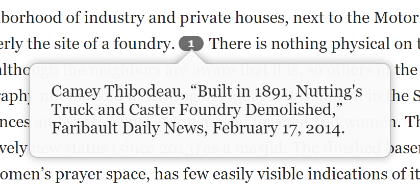
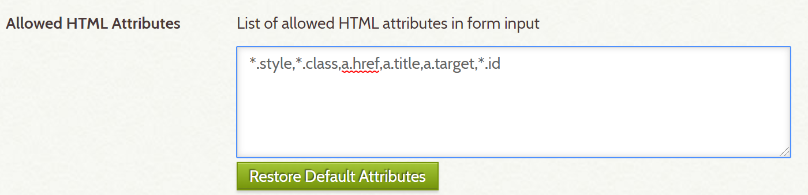

# OmekaFootnotesJS

## Summary

An Omeka plugin to add interactive JavaScript footnotes to exhibit pages and simple pages by extending the TinyMCE wysiwyg HTML editor.

This plugin uses Bigfoot.js version 2.1.4

### Footnotes in action:

## Installation

1. Make sure you have ExhibitBuilder and SimplePages installed in your Omeka site

2. Install the OmekaFootnotesJS plugin

3. Add '*.id' to Allowed HTML Attributes in Omeka security settings and save changes.

## Use Instructions

### 1. To add/edit footnotes:

a. Position your cursor in the place you'd like to add a footnote, then press the "Add Footnote" button on the toolbar. A footnote link will be inserted at that point, and a footnote text snippet will appear at the end of the text block.
   
b. To change the content of the footnote, edit the text snippet at the bottom of the editor that corresponds to your numbered footnote. If citing a source, best practice is to do so in a standard bibliographic format for your discipline and apply a link if it can be accessed online.
   
c. Refer to (3) to update the order of your footnotes if necessary (in most cases, this should be handled automatically).

### 2. To remove a footnote:
   
a. Highlight the footnote link in the text. You may highlight multiple footnotes at the same time, but note that all footnotes you highlight will be deleted.
   
b. Press the "Delete Selected Footnotes" button on the toolbar. The footnotes you selected, along with their associated text snippets, will be removed.
   
c. Refer to (3) to update the order of your footnotes if necessary (in most cases, this should be handled automatically).

### 3. To reorder footnotes:
  
a. Press the "Update Footnotes" button on the toolbar. This will reorder your footnotes in order of appearance.

## License

This plugin is published under [GNU/GPL](https://www.gnu.org/licenses/gpl-3.0.html).

This program is free software; you can redistribute it and/or modify it under the terms of the GNU General Public License as published by the Free Software Foundation; either version 3 of the License, or (at your option) any later version.

This program is distributed in the hope that it will be useful, but WITHOUT ANY WARRANTY; without even the implied warranty of MERCHANTABILITY or FITNESS FOR A PARTICULAR PURPOSE. See the GNU General Public License for more details.

You should have received a copy of the GNU General Public License along with this program; if not, write to the Free Software Foundation, Inc., 51 Franklin Street, Fifth Floor, Boston, MA 02110-1301 USA.

## Contact

Maintained by [Digital Humanities @ Carleton College](https://www.carleton.edu/digital-humanities/)
